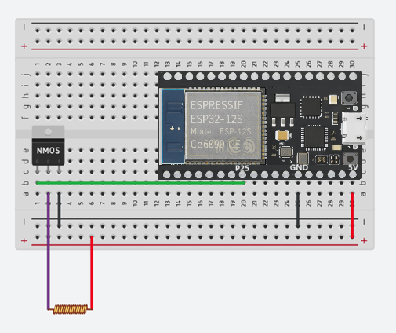

# 電波時計用電波発生器

Radio generator for RadioClock in Japan

ESP32を利用して、NTPサーバーから取得した正確な時刻をもとに日本の標準電波(JJY)を疑似的に生成・送信します。電波が届きにくい鉄筋コンクリートの室内でも、市販の電波時計を正確に合わせることができます。

## 本装置の特徴

* **NTPによる高精度な時刻同期**: インターネット経由でNTPサーバーから正確な時刻を取得し、常にミリ秒単位で正確な日本標準時を維持します。
* **電波時計の受信特性に合わせた間欠動作**: 
  市販の電波時計が受信を行いやすいスケジュール（例：深夜2時、6時、14時など）に合わせて自動で起床し、電波を送信します。
* **ディープスリープによる省電力設計**:
  1回の動作時間は30分間に設定されており、送信終了後は次のスケジュールまでESP32のディープスリープ機能を使用して消費電力を極限まで抑えつつ、余計な電波を送信しません。
* **低コスト・シンプル構成**: 安価なESP32と最小限の部品（MOSFET 1つ、コイル 1つ）のみで動作する、極めてシンプルな回路を実現しました。
* **自動時刻更正機能**: 起動時にWi-Fiへ接続し、自動的に最新時刻を取得。一度設置すれば、メンテナンスフリーで電波時計の時刻を合わせ続けます。
* **効率的なハードウェアPWM制御**: ESP32の内蔵発振器（ハードウェアPWM）を活用し、40kHz/60kHzの搬送波を安定して生成します。

## 必要なハードウェア (Hardware Requirements)

* **ESP32 開発ボード** (ESP32-Cなど、800円前後)
* **Nch-MOSFET** (使用例: 2SK2232、100円ぐらい)
* **バーアンテナ/コイル** (フェライトバーが200円ぐらいで2種ポリウレタン銅線が千円前後、下記参考リンクの[Raspberry Piで作るJJYシミュレータ (Rabbit Note)](https://rabbit-note.com/2017/04/01/raspberry-pi-jjy-repeater/)の「アンテナの作成」にアンテナの作り方が書いてありますので参考にしてください)
* **ブレッドボード**  (250円前後)

## 回路図 (Circuit Diagram)
以下の図は、JJY信号を送信するためのアンテナ駆動回路です。ESP32のPWM出力を利用してMOSFETをスイッチングし、コイルを駆動させます。

### 配線手順 (Wiring)

1. ESP32のGPIO 25をMOSFETのGateにブレッドボード経由で接続します。
2. ESP32の電源ピン(3.3Vまたは5V)を アンテナコイルの片側にブレッドボード経由で接続します。
3. アンテナのもう片側をMOSFETのDrainに接続します。
4. MOSFETのSourceをESP32のGNDにブレッドボード経由で接続します。

## ビルド手順

* お手持ちの電波時計の説明書を参照し、本装置が起動する時刻を確認し、platformio.iniの以下の行を修正してください。下記の例は2:00, 6:00, 14:00に本装置が起動することを示しています(起動30分後に自動的に電波の送信を終えスリープします)。

         -DWAKEUP_SCHEDULE="HOUR_MIN(2, 0), HOUR_MIN(6, 0), HOUR_MIN(14, 0)"

* ESP32上にプログラム制御可能なLEDがある場合、本装置が動作中は点滅します。このプログラムでは自動的に定義されるBUILTIN_LEDマクロが手ぎされていれば自動的にその値を参照してLEDを点滅させます。プログラム制御可能なLEDがあるにもかかわらずLEDが点滅しない場合はplatformio.iniの以下の行にそのLEDを制御するGPIOの番号を指定してください。デフォルトでは2が指定されています。ブレッドボード上に外付けでLED(と抵抗)を設置して点滅させることも可能です。その場合はそのLEDをつないだGPIOピン番号を指定してください。LEDを点滅させたくない場合は未使用のGPIO番号(例：GPIO 4など)を指定してください。

         -DLED_BUILTIN=2

* 東日本の方はVS Codeにてenv:esp32_40khzで、西日本の方はenv:esp32_60khzでビルドしてください。

## 電波法について

本装置は、アンテナ付近の極めて限定された範囲(およそ3m以下)でのみ電波時計を動作させることを目的としています。
電波法に定める「微弱無線局」の規定(電界強度の許容値)を超えないよう、アンテナの巻き数や出力を調整し、周囲の通信を妨害しないよう十分注意して使用してください。

## 参考リンク

* **[Raspberry Piで作るJJYシミュレータ (Rabbit Note)](https://rabbit-note.com/2017/04/01/raspberry-pi-jjy-repeater/)**:
  本装置の設計において多大なインスピレーションをいただいたサイトです。こちらのサイトではラズパイを使ってますがラズパイに代わってESP32を採用することで、よりシンプルで安価な回路構成を実現しました。
* **[標準電波の出し方 (NICT)](https://jjy.nict.go.jp/jjy/trans/index.html)**:
  日本標準電波（JJY）のタイムコード仕様の公式ドキュメントです。

